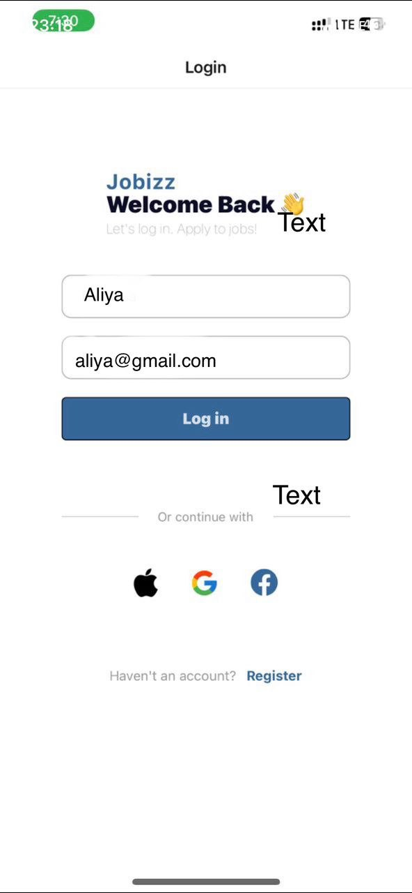
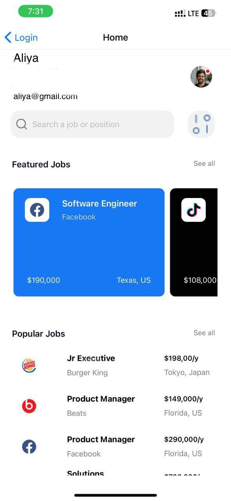

# Jobizz

Jobizz is a React Native Expo application that allows users to log in using their name and email. It also provides options to continue with Apple, Google, or Facebook.

## Components

### Login

The `Login` component is the main login screen of the application. It includes the following features:

- **Name and Email Input:** Two text input fields for the user to enter their name and email. These fields are required and will show error messages if left empty.
- **Log In Button:** A button that validates the input fields and navigates to the Home screen if the validation is successful.
- **Continue with Social Media:** Options to continue logging in with Apple, Google, or Facebook.
- **Register Link:** A link for users who don't have an account to register.

#### Usage

The `Login` component is used as the initial screen of the application where users can enter their login details.

### Screenshots

#### Login Screen

 #### Home Screen

